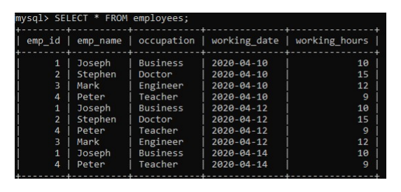

# sql-queries


## 1. SQL Query to fetch records from that are present in one table but not in another table.


```sql
SELECT EmployeeDetails.*
FROM EmployeeSalary
LEFT JOIN
EmployeeSalary USING (EmpId)
WHERE EmployeeSalary.EmpId IS NULL;
```
## 2. SQL query to fetch all the employees who are not working on any project.

```sql
SELECT EmpId 
FROM EmployeeSalary 
WHERE Project IS NULL;
```
## 3. SQL query to fetch all the Employees from EmployeeDetails who joined in the Year 2020.

```sql
SELECT * FROM EmployeeDetails
WHERE DateOfJoining BETWEEN '2020/01/01'
AND '2020/12/31';
```
## 4. Fetch all employees from EmployeeDetails who have a salary record in EmployeeSalary.

```sql
SELECT * FROM EmployeeDetails E
WHERE EXISTS
(SELECT * FROM EmployeeSalary S 
WHERE  E.EmpId = S.EmpId);
```
## 5. Write an SQL query to fetch a project-wise count of employees sorted by project’s count in descending order.

```sql
SELECT Project, count(EmpId) EmpProjectCount
FROM EmployeeSalary
GROUP BY Project
ORDER BY EmpProjectCount DESC;
```
## 6.Fetch employee names and salaries even if the salary value is not present for the employee.

```sql
SELECT E.FullName, S.Salary 
FROM EmployeeDetails E 
LEFT JOIN 
EmployeeSalary S
ON E.EmpId = S.EmpId;
```
## 7.	Write an SQL query to fetch all the Employees who are also managers from the EmployeeDetails table..

```sql
SELECT DISTINCT E.FullName
FROM EmployeeDetails E
INNER JOIN EmployeeDetails M
ON E.EmpID = M.ManagerID;

```
## 8.	Write an SQL query to fetch duplicate records from EmployeeDetails.

```sql
SELECT FullName, ManagerId, DateOfJoining, City, COUNT(*)
FROM EmployeeDetails
GROUP BY FullName, ManagerId, DateOfJoining, City
HAVING COUNT(*) > 1;
```
## 9. Write an SQL query to fetch only odd rows from the table.

```sql
SELECT * FROM EmployeeDetails 
WHERE MOD (EmpId, 2) <> 0;
```
## 10.	Write a query to find the 3rd highest salary from a table without top or limit keyword.

```sql
SELECT Salary
FROM EmployeeSalary Emp1
WHERE 2 = (
                SELECT COUNT( DISTINCT ( Emp2.Salary ) )
                FROM EmployeeSalary Emp2
                WHERE Emp2.Salary > Emp1.Salary
            )
```
## 11.	Write an SQL query to fetch the EmpId and FullName of all the employees working under the Manager with id – ‘986’.

```sql
SELECT  EmpId, FullName
FROM EmployeeDetails
WHERE ManagerId = 986;
```
## 12.	Write an SQL query to fetch the different projects available from the EmployeeSalary table.

```sql
SELECT DISTINCT(Project)
FROM EmployeeSalary;
```
## 13.	Write an SQL query to fetch the count of employees working in project ‘P1’.

```sql
SELECT COUNT(*) 
FROM EmployeeSalary 
WHERE Project = 'P1';
```
## 14.	Write an SQL query to find the maximum, minimum, and average salary of the employees.

```sql
SELECT Max(Salary), 
Min(Salary), 
AVG(Salary) 
FROM EmployeeSalary;
```
## 15.	Write an SQL query to find the employee id whose salary lies in the range of 9000 and 15000.

```sql
SELECT EmpId, Salary
FROM EmployeeSalary
WHERE Salary BETWEEN 9000 AND 15000;

```
## 16.	Write an SQL query to fetch those employees who live in Toronto and work under the manager with ManagerId – 321.

```sql
SELECT EmpId, City, ManagerId
FROM EmployeeDetails
WHERE City='Toronto' AND ManagerId='321';
```
## 17.	Write an SQL query to fetch all the employees who either live in California or work under a manager with ManagerId – 321.

```sql
SELECT EmpId, City, ManagerId
FROM EmployeeDetails
WHERE City='California' OR ManagerId='321';
```
## 18.	Write an SQL query to fetch all those employees who work on Projects other than P1.

```sql
SELECT EmpId
FROM EmployeeSalary
WHERE NOT Project='P1';
```
## 19.	Write an SQL query to display the total salary of each employee adding the Salary with Variable value.

```sql
SELECT EmpId,
Salary+Variable as TotalSalary 
FROM EmployeeSalary;

```
## 20.	Write an SQL query to fetch the employees whose name begins with any two characters, followed by a text “hn” and ends with any sequence of characters.

```sql
SELECT FullName
FROM EmployeeDetails
WHERE FullName LIKE ‘__hn%’;
```
## 21.	Write an SQL query to fetch all the EmpIds which are present in either of the tables – ‘EmployeeDetails’ and ‘EmployeeSalary’.

```sql
SELECT EmpId FROM EmployeeDetails
UNION 
SELECT EmpId FROM EmployeeSalary;

```
## 22.	Write an SQL query to fetch common records between two tables. Ans. SQL Server – Using INTERSECT operator-

```sql
SELECT * FROM EmployeeSalary
INTERSECT
SELECT * FROM ManagerSalary;
```
## 23.	Write an SQL query to fetch records that are present in one table but not in another table. Ans. SQL Server – Using MINUS- operator-

```sql
SELECT * FROM EmployeeSalary
MINUS
SELECT * FROM ManagerSalary;
```
## 24.	Write an SQL query to fetch the EmpIds that are present in both the tables –  ‘EmployeeDetails’ and ‘EmployeeSalary.

```sql
SELECT EmpId FROM 
EmployeeDetails 
where EmpId IN 
(SELECT EmpId FROM EmployeeSalary);
```
## 25.	Write an SQL query to fetch the EmpIds that are present in EmployeeDetails but not in EmployeeSalary. Using subquery-

```sql
SELECT EmpId FROM 
EmployeeDetails 
where EmpId Not IN 
(SELECT EmpId FROM EmployeeSalary);
```
## 26.	Write an SQL query to fetch the employee’s full names and replace the space with ‘-’. Ans. Using the ‘Replace’ function-

```sql
SELECT REPLACE(FullName, ' ', '-') 
FROM EmployeeDetails;
```
## 27.	Write an SQL query to fetch the position of a given character(s) in a field. Ans. Using the ‘Instr’ function-

```sql
SELECT INSTR(FullName, 'Snow')
FROM EmployeeDetails;
```
## 28. Write an SQL query to display both the EmpId and ManagerId together.Ans. Here we can use the CONCAT command

```sql
SELECT CONCAT(EmpId, ManagerId) as NewId
FROM EmployeeDetails;
```
## 29.	Write a query to fetch only the first name(string before space) from the FullName column of the EmployeeDetails table. Ans. In this question, we are required to first fetch the location of the space character in the FullName field and then extract the first name out of the FullName field.

## For finding the location we will use the LOCATE method in MySQL and CHARINDEX in SQL SERVER and for fetching the string before space, we will use the SUBSTRING OR MID method.

## MySQL – using MID

```sql
SELECT MID(FullName, 1, LOCATE(' ',FullName)) 
FROM EmployeeDetails;
```
## 30.	Write an SQL query to uppercase the name of the employee and lowercase the city values.

```sql
SELECT UPPER(FullName), LOWER(City) 
FROM EmployeeDetails;
```

## 31.	Write an SQL query to find the count of the total occurrences of a particular character – ‘n’ in the FullName field.

```sql
SELECT FullName, 
LENGTH(FullName) - LENGTH(REPLACE(FullName, 'n', ''))
FROM EmployeeDetails;
```

## 32.	Write an SQL query to find the current date-time.

```sql
SELECT NOW();
```

## 33.	Write an SQL query to fetch all the Employee details from the EmployeeDetails table who joined in the Year 2020.

```sql
SELECT * FROM EmployeeDetails
WHERE DateOfJoining BETWEEN '2020/01/01'
AND '2020/12/31';
```

## 34.	Write an SQL query to fetch all employee records from the EmployeeDetails table who have a salary record in the EmployeeSalary table.

```sql
SELECT * FROM EmployeeDetails E
WHERE EXISTS
(SELECT * FROM EmployeeSalary S 
WHERE  E.EmpId = S.EmpId);
```

## 35.	Write an SQL query to fetch the project-wise count of employees sorted by project’s count in descending order.

```sql
SELECT Project, count(EmpId) EmpProjectCount
FROM EmployeeSalary
GROUP BY Project
ORDER BY EmpProjectCount DESC;
```

## 36.	Write a query to fetch employee names and salary records. Display the employee details even if the salary record is not present for the employee.

```sql
SELECT E.FullName, S.Salary 
FROM EmployeeDetails E 
LEFT JOIN 
EmployeeSalary S
ON E.EmpId = S.EmpId;
```

## 37.	Write an SQL query to fetch all the Employees who are also managers from the EmployeeDetails table.

```sql
SELECT DISTINCT E.FullName
FROM EmployeeDetails E
INNER JOIN EmployeeDetails M
ON E.EmpID = M.ManagerID;
```
## 38.	Write an SQL query to fetch duplicate records from EmployeeDetails (without considering the primary key – EmpId).

```sql
SELECT FullName, ManagerId, DateOfJoining, City, COUNT(*)
FROM EmployeeDetails
GROUP BY FullName, ManagerId, DateOfJoining, City
HAVING COUNT(*) > 1;
```
## 39.	Write an SQL query to remove duplicates from a table without using a temporary table.

```sql
DELETE E1 FROM EmployeeDetails E1
INNER JOIN EmployeeDetails E2 
WHERE E1.EmpId > E2.EmpId 
AND E1.FullName = E2.FullName 
AND E1.ManagerId = E2.ManagerId
AND E1.DateOfJoining = E2.DateOfJoining
AND E1.City = E2.City;
```

## 40.	Write an SQL query to fetch only odd rows from the table.

```sql
SELECT * FROM EmployeeDetails 
WHERE MOD (EmpId, 2) <> 0;
```

## 41.	Write an SQL query to create a new table with data and structure copied from another table.

```sql
CREATE TABLE NewTable 
SELECT * FROM EmployeeSalary;
```

## 42.	Write an SQL query to create an empty table with the same structure as some other table.

```sql
CREATE TABLE NewTable 
SELECT * FROM EmployeeSalary where 1=0;
```

## 43.	Write an SQL query to find the nth highest salary from a table.

```sql
SELECT Salary
FROM Employee
ORDER BY Salary DESC LIMIT N-1,1;
```

## 44.	Write SQL query to find the 3rd highest salary from a table 

```sql
SELECT Salary
FROM EmployeeSalary Emp1
WHERE 2 = (
            SELECT COUNT( DISTINCT ( Emp2.Salary ) )
            FROM EmployeeSalary Emp2
            WHERE Emp2.Salary > Emp1.Salary
            )
```


## 45.	Write a SQL query to fetch the PatientName in uppercase and state as lowercase. Also use the ALIAS name for the result-set as PatName and NewState.

```sql
SELECT upper(Patient Name) as PatName , lower(state) as NewState
from Patients;
```

## 46.	Find the Nth highest consultation fees from the PatientsCheckup table.

```sql
SELECT ConsultationFees
FROM PatientsCheckup
ORDER BY ConsultationFees DESC LIMIT N-1,1;
```

## 47.	Write a query to fetch top N records ordered by ConsultationFees.

```sql
SELECT * FROM PatientsCheckup ORDER BY ConsultationFees DESC LIMIT N;
```

## 48.	Write a query to retrieve the list of patients from the same state.

```sql
SELECT DISTINCT P.PatientID, P.PatientName, P.State
FROM Patients P, Patient P1
WHERE P.State = P1.State AND P.PatientID != P1.PatientID;
```

## 49.	Write a query to retrieve two minimum and maximum consultation fees from the PatientsCheckup Table.

```sql
– TWO MINIMUM CONSULTATION FEES
 SELECT DISTINCT ConsultationFees FROM PatientsCheckup P1
 WHERE 2 >= (SELECT COUNT(DISTINCT ConsultationFees)FROM PatientsCheckup P2
 WHERE P1.ConsultationFees >= P2.ConsultationFees) ORDER BY P1.SConsultationFees DESC;

  – TWO MAXIMUM CONSULTATION FEES
SELECT DISTINCT ConsultationFees FROM PatientsCheckup P1
 WHERE 2 >= (SELECT COUNT(DISTINCT ConsultationFees)FROM PatientsCheckup P2
 WHERE P1.ConsultationFees <= P2.ConsultationFees) ORDER BY P1.ConsultationFees DESC;

```

## 50.	Write a query to fetch patient details along with the weight fees, even if the details are missing.

```sql
SELECT P.PatientName, C.ConsultationFees
FROM Patients P 
LEFT JOIN 
PatientsCheckup C
ON P.PatientId = C.PatientId;

```

## 51.	Write a SQL query to fetch doctor wise count of patients sorted by the doctors

```sql
SELECT DoctorID, COUNT(PatientID) AS DocPat
FROM Patients GROUP BY DoctorID
ORDER BY DocPat;
```
## 52.	Write a SQL query to fetch the first and last record of the Patients table.

```sql
–FETCH FIRST RECORD
SELECT * FROM Patients WHERE PatientID = (SELECT MIN(PatientID) FROM Patients);
 
–FETCH LAST RECORD
SELECT * FROM Patients WHERE PatientID = (SELECT MAX(PatientID) FROM Patients);

```

## 53.	Write a SQL query to fetch consultation fees – wise count and sort them in descending order.

```sql
SELECT ConsultationFees, COUNT(PatientId) CFCount
FROM PatientsCheckup 
GROUP BY ConsultationFees
ORDER BY CFCount DESC;

```

## 54.	Write a SQL query to retrieve patient details from the Patients table who have a weight in the PatientsCheckup table.

```sql
SELECT * FROM Patients P
WHERE EXISTS
(SELECT * FROM PatientsCheckup C WHERE P.PatientID = C.PatientID);

```

## 55.	Write a SQL query to retrieve the last 2 records from the Patients table.

```sql
SELECT * FROM Patients WHERE
PatientID <=2 UNION SELECT * FROM
(SELECT * FROM Patients P ORDER BY P.PatientID DESC)
AS P1 WHERE P1.PatientID <=2;

```

## 56.	Write a SQL query  to find all the patients who joined in the year 2022.

```sql
SELECT * FROM Patients
WHERE RegDate BETWEEN '2021/01/01' AND '2021/12/31';
```

## 57.	Write a query to find those patients who have paid consultation fees between 400 to 700.

```sql
SELECT * FROM Patients WHERE PatientID IN 
(SELECT PatientID FROM PatientsCheckup WHERE ConsultationFees BETWEEN '400' AND '700');

```

## 58.	Write a query to add email validation to your database.

```sql
SELECT email FROM Patients WHERE NOT REGEXP_LIKE(email, ‘[A-Z0-9._%+-]+@[A-Z0-9.-]+.[A-Z]{2,4}’, ‘i’);

```
## 59.	Write a SQL query to fetch details of all patients excluding patients with name  “Sheela” and “Anay”.

```sql
SELECT * FROM Patients WHERE PatientName NOT IN ('Sheela','Anay'); 
```

## 60.	Write a query to retrieve the first three characters of  PatientName from the Patients table.

```sql
SELECT SUBSTRING(PatientName, 1, 3) FROM Patients; 

```

## 61.	Write a query to fetch PatientIDs  which are present in: 

```sql
SELECT PatientId FROM Patients 
WHERE PatientId IN 
(SELECT PatientId FROM PatientsCheckup);

```

## 62.	Write a query to find the number of patients whose RegDate is between 01/04/2021 to 31/12/2022 and are grouped according to state.

```sql
–Present IN BOTH TABLES
SELECT PatientId FROM Patients 
WHERE PatientId IN 
(SELECT PatientId FROM PatientsCheckup);

```

## 63.	Write a query to fetch all records from the Patients table; ordered by PatientName in ascending order, State in descending order.

```sql
SELECT * FROM Patients ORDER BY PatientName ASC, State DESC;

```


## 64.	Lists the number of customers in each country. Only include countries with more than 5 customers:

```sql
SELECT COUNT(CustomerID), Country
FROM Customers
GROUP BY Country
HAVING COUNT(CustomerID) > 5;

```

## 65.	Lists the number of customers in each country, sorted high to low (Only include countries with more than 5 customers):

```sql
SELECT COUNT(CustomerID), Country
FROM Customers
GROUP BY Country
HAVING COUNT(CustomerID) > 5
ORDER BY COUNT(CustomerID) DESC;

```


## 66.	Lists the employees that have registered more than 10 orders

```sql
SELECT Employees.LastName, COUNT(Orders.OrderID) AS NumberOfOrders
FROM (Orders
INNER JOIN Employees ON Orders.EmployeeID = Employees.EmployeeID)
GROUP BY LastName
HAVING COUNT(Orders.OrderID) > 10;

```

## 67.	Lists if the employees "Davolio" or "Fuller" have registered more than 25 orders:

```sql
SELECT Employees.LastName, COUNT(Orders.OrderID) AS NumberOfOrders
FROM Orders
INNER JOIN Employees ON Orders.EmployeeID = Employees.EmployeeID
WHERE LastName = 'Davolio' OR LastName = 'Fuller'
GROUP BY LastName
HAVING COUNT(Orders.OrderID) > 25;

```


## 68.	Lists the number of orders sent by each shipper

```sql
SELECT Shippers.ShipperName, COUNT(Orders.OrderID) AS NumberOfOrders FROM Orders
LEFT JOIN Shippers ON Orders.ShipperID = Shippers.ShipperID
GROUP BY ShipperName;

```


## 69.	Lists the suppliers with a product price less than 20 by using SQL Exists.

```sql
SELECT SupplierName
FROM Suppliers
WHERE EXISTS (SELECT ProductName FROM Products WHERE SupplierId = Suppliers.supplierId AND Price < 20);

```

## 70.	Lists the suppliers with a product price equal to 22 by using SQL Exists.

```sql
SELECT SupplierName
FROM Suppliers
WHERE EXISTS (SELECT ProductName FROM Products WHERE SupplierId = Suppliers.supplierId AND Price = 22);

```


## 71.	Write a SQL query to know the actual student name for each of the comments

```sql
SELECT students.name, comments.forum_username, comments.comment
FROM students
INNER JOIN comments
  ON students.forum_username = comments.forum_username
ORDER BY students.name ASC;

```
## 72.	Write a query to display all the records of the Student table that matched and non matched too.

```sql
SELECT students.name, comments.forum_username, comments.comment
FROM students
LEFT JOIN comments
  ON students.forum_username = comments.forum_username
ORDER BY students.name ASC;

```

## 73.	Write a query to display all the records of the Comments table that matched and non matched too.

```sql
SELECT
  students.name,
  comments.forum_username,
  comments.comment
FROM students
RIGHT JOIN comments
  ON students.forum_username = comments.forum_username
ORDER BY students.name ASC;

```

## 74.	Write a query to display the Cartesian product of student and comment table.

```sql
SELECT *
FROM students
CROSS JOIN comments
ORDER BY students.name ASC;

```


## 75.	Execute the following query that uses the COUNT(expression) function to calculates the total number of employees name available in the table:

```sql
SELECT COUNT(emp_name) FROM employees;    

```

## 76.	Execute the following statement that returns all rows from the employee table and WHERE clause specifies the rows whose value in the column emp_age is greater than 32:

```sql
SELECT COUNT(*) FROM employees WHERE emp_age>32; 

```

## 77.	This statement uses the COUNT(distinct expression) function that counts the Non-Null and distinct rows in the column emp_age:

```sql
SELECT COUNT(DISTINCT emp_age) FROM employees;  

```

## 78.	By use the count() function with the GROUP BY clause that returns the count of the element in each group. For example, the following statement returns the number of employee in each city:

```sql
SELECT emp_name, city, COUNT(*) FROM employees GROUP BY city;

```

## 79.	Use ORDER BY and Having clause with the count() function. Execute the following statement that gives the employee name who has at least two age same and sorts them based on the count result:

```sql
SELECT emp_name, emp_age, COUNT(*) FROM employees   
GROUP BY emp_age   
HAVING COUNT(*)>=2   
ORDER BY COUNT(*);  

```



## 80.	Write a query that calculates the total number of working hours of all employees in the table:

```sql
SELECT SUM(working_hours) AS "Total working hours" FROM employees;  

```

## 81.	Write a query used to return the result based on the condition specified in the WHERE clause. Execute the following query to calculate the total working hours of employees whose working_hours >= 12.

```sql
 SELECT SUM(working_hours) AS "Total working hours" FROM employees WHERE working_hours>=12; 

```

## 82.	Write a query to use the SUM() function with the GROUP BY clause to return the total summed value for each group. For example, this statement calculates the total working hours of each employee by using the SUM() function with the GROUP BY clause, as shown in the following query:

```sql
SELECT emp_id, emp_name, occupation, SUM(working_hours) AS "Total working hours" FROM employees GROUP BY occupation;

```

## 83.	Use having clause to execute the following statement that calculates the working hours of all employees, grouping them based on their occupation and returns the result whose Total_working_hours>24.

```sql
 SELECT emp_id, emp_name, occupation,   
SUM(working_hours) Total_working_hours   
FROM employees   
GROUP BY occupation   
HAVING SUM(working_hours)>24; 

```

## 84.	Uses the DISTINCT keyword to remove the duplicate rows from the column name. This clause can also be used with sum() function to return the total summed value of a Unique number of records present in the table.

```sql
SELECT emp_name, occupation,   
SUM(DISTINCT working_hours) Total_working_hours  
FROM employees   
GROUP BY occupation;  
 

```


## 85.	Write a query shows the Subject_Name of those subjects whose Subject_ID is BCA103 and BCA106:

```sql
SELECT * FROM Student WHERE Subject_ID = 'BCA103' and Subject_ID = 'BCA106' ;  

```

## 86.	Write a query in SQL to find the minimum and maximum number from the integer column

```sql
SELECT MAX(Stu_Marks), MIN(Stu_Marks) FROM Student;

```

## 87.	Write a query to access the first record from the SQL table?

```sql
SELECT * FROM Student WHERE Rownum = 1;  

```

## 88.	Write a query to access the first Nth rows from the table?

```sql
select * from sales limit 0,5;

```

## 89.	Write a query in SQL to create a new table with the same data and structure as an existing table.

```sql
CREATE TABLE Student_Marks SELECT * FROM Student;  

```

## 90.	Write a query shows the 3rd highest marks from the Student table:

```sql
select *
from Student
order by Stu_Marks desc
limit 2,1


```
## 91.	Write a query shows the second-highest marks from the student table:

```sql
Select MAX(Stu_Marks) from Student   
where Stu_Marks NOT IN (Select MAX(Stu_Marks) from Student);  
```

## 92.	Write  query shows the record of the three highest marks from the student table:

```sql
select *
from Student
order by Stu_Marks desc
limit 0,3;
```

## 93.	Write an SQL query to fetch the Stu_Name and Stu_Marks of those students whose age is 20.

```sql
SELECT Stu_Name, Stu_Marks FROM Student WHERE Stu_Age = 20; 

```

## 94.	Write a query to show the maximum marks of each subject.

```sql
Select Student_ID, Stu_Subject_ID, MAX(Stu_Marks) from Student group by Stu_Subject_ID;  

```

## 95.	Write a query to show all the record of those students whose Marks is greater than 82 and age is 22

```sql
SELECT * FROM Student WHERE Stu_Marks > 82 and Stu_Age = 22;  

```

## 96.	Write a query to show the record of those students whose name begins with the 'm' character.

```sql

SELECT * FROM Student WHERE Stu_Name LIKE '%m';  

```

## 97.	Write an SQL query to show the unique values of Stu_Age from the student table:

```sql
SELECT DISTINCT(Stu_Age) from Student; 

```

## 98. Write query shows the first two characters of Stu_Name from the Student table:

```sql
SELECT SUBSTRING(Stu_Name, 1, 2) from Student;  
```

## 99.	Write query creates the View of those students whose Marks is greater than 85 from the Student table:

```sql
CREATE VIEW Student_Age AS SELECT Stu_Name, Stu_Age FROM Student WHERE Stu_Marks < 85;  

```

## 100.	Write a query finds the average of marks of Student table:

```sql
SELECT AVG (Stu_Marks ) FROM Student;  
```
